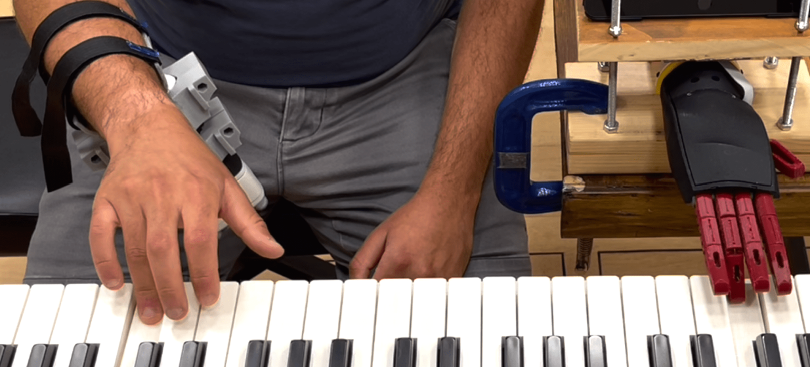

# Musical Notes Prediction for Robotic Prosthetics  
## About
This project expands an implementation of the MusicTranformer architecture for a project in piano playing prediciton. 
The original implementation can be found here: https://github.com/gwinndr/MusicTransformer-Pytorch. 
It is a reproduction of the MusicTransformer (Huang et al., 2018) for Pytorch. 
This implementation utilizes the generic Transformer implementation introduced in Pytorch 1.2.0 (https://pytorch.org/docs/stable/nn.html#torch.nn.Transformer).

In this project, we explore the application of the musical tranformer architecture and expand its capabilities in representing data,
in order to predict musical notes played on a piano, incorporating positional data of the player's hand.
Our aim is to enable smart and accessible piano playing, particularly for users requiring assistive technology,
by creating a model capable of predicting future notes based on MIDI sequences and hand positioning.

  

*The information gathered from the moving hand in order to predict the next musical note*

  

*A robotic hand system whose finger positioning predictions we aim to improve (image taken from the paper "Towards Predicting Fine Finger Motions from Ultrasound Images via
Kinematic Representation"*

## Installation
The project supports Pytorch >= 1.2.0 with Python >= 3.6.
In order to install the environment and necessery datasets:

1. Download the Maestro dataset from [here](https://magenta.tensorflow.org/datasets/maestro) 

2. Run `preprocess_midi.py -output_dir /preprocessed_maestro <path_to_maestro_data>`, or run with `--help` for details. This will write pre-processed data into folder split into train, val, and test as per Maestro's recommendation.

## Overview

### Training
For training, we first used the Maestro Dataset as a base, then fine-tuned on dataset_with_hands (collected by Vista lab), which contains both MIDI files and hand positioning data in the corresponding folder.
For replicating, run:

`python train.py -input_dir ./preprocessed_maestro -epochs 70 -output_dir ./saved_models`

This will create a saved_models folder, containing all training information and weights.
Then, for fine-tuning on dataset_with_hands, run 
`preprocess_midi.py -output_dir ./preprocessed_hands ./dataset_with_hands/midis`
for spliting the dataset into train, eval and test, and then run:

`python train.py -input_dir ./preprocessed_hands -continue_weights ./saved_models/weights/epoch_0070.pickle -continue_epoch 70 -epochs 90 -output_dir ./saved_models`

This will write additional 20 epochs, trained on dataset_with_hands.
You can change the finetuning point by setting `continue_weights` to a different weight file and `continue_epoch` to a different number,
or alternatively train on the Maestro Dataset for a different number of epochs.

### Evaluation / Testing
At any point of training you can evaluate the model's performance using 

`python evaluate.py -model_weights ./saved_models/results/best_acc_weights.pickle -dataset_dir ./preprocessed_hands`

if you want to evaluate on a different pre-processed dataset you can change the `dataset_dir` argument.

### Generation
You can generate a piece with a trained model by using:

`python generate.py -output_dir output -midi_root some_midi_file.midi -model_weights ./saved_models/results/best_acc_weights.pickle`

### Results and Graph Representation
You can also generate graphs representing the loss and accuracy during the training process:

`python graph_results.py -input_dirs ./saved_models/results -model_names model`

Notice the saved_models folder will store loss/accuracy information in a CSV file as long as it is not deleted or a different folder is used.

  

*Graph representation of the results generated after training on Maestro-Dataset and finetuning on Dataset-With-Hands*

Out results of fine-tuning without the hand positions information are as follows:
| Epoch starting point    | Best eval accuracy | Best loss accuracy |
| ----- | ---------- | ---------- |
| 50    | 0.36087    | 2.368667   |
| 60    | 0.366437   | 2.3357536  |
| 70    | 0.366953   | 2.340185   |
| 80    | 0.3615234  | 2.35800906 |

And the results of the training with hand positions are:

Best eval acc: 0.39706962564018333

Best eval loss: 2.0857395308741022

### Additional Information
- The file utilities/argument_funcs contains all the default argument values for the train, evaluate and generate commands.
- The previous_models folder contains information about different models we trained using the dataset.
    - start_x: trained parameters based on fine-tuning with dataset_without_hands, starting with epoch x
    - saved_model_with_hands: trained parameters based on dataset_with_hands
    - finedtuned_model_with_hands: parameters of model trained on the Maestro dataset, and then finetuned (after epoch 70) on dataset_with_hands
